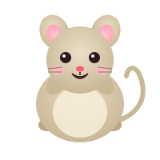

# 🐭 Dancing Mouse

키보드를 칠 때마다 귀여운 쥐가 춤춥니다. **데스크탑 오버레이** 와 **풀스크린 웹 UI** 두 가지 모드로 동작합니다.



## 모드

| 모드 | 명령 | 설명 |
|------|------|------|
| **데스크탑 오버레이** | `npm run overlay` | Electron 으로 화면 우하단에 캐릭터만 떠있음. 어디서 타이핑하든 글로벌 키 후킹으로 반응 |
| **웹 UI** | `npm run dev` | 브라우저 풀스크린, 헤더/입력 버퍼/응원 멘트 포함 |

## 빠른 시작

```bash
git clone https://github.com/sunhwa508/dancing-mouse-app.git
cd dancing-mouse-app
npm install

# A) 데스크탑 오버레이 (추천)
npm run overlay

# B) 웹 UI
npm run dev          # http://localhost:5173
```

> **macOS 권한**: 오버레이의 글로벌 키 감지를 위해 첫 실행 시
> `시스템 설정 → 개인정보 보호 및 보안 → 손쉬운 사용` 에서 `Electron` 항목을 켜주세요.
> 권한이 없으면 캐릭터는 떠있지만 키 입력에 반응하지 않습니다.

## 미리보기

- 8개 SVG 댄스 포즈 순환 (`arms-up → lean-right → jump → lean-left → kick → peace → kick-right → spin`)
- 키 입력마다 포즈 전환 + 음표/별 파티클이 위로 튀어오름
- 키 입력이 없으면 부드럽게 숨쉬는 idle 애니메이션
- 오버레이는 frameless / transparent / always-on-top — 드래그로 위치 이동 가능

## 빌드

```bash
npm run build        # dist/ 에 정적 파일 생성
npm run preview      # 빌드 결과 미리보기
```

## 정적 SVG 이미지 추출

8개 포즈는 `public/mouse/pose-*.svg` 에 정적 파일로도 들어있어요. 이미지를 새로
빼고 싶으면:

```bash
npm run export-poses
```

`scripts/export-poses.tsx` 가 React SSR 로 각 포즈를 렌더링해서 `public/mouse/`
와 `public/mouse-icon.svg` 를 갱신합니다.

## 구조

```
electron/
├── main.cjs                 # transparent / frameless / always-on-top 윈도우 + 글로벌 키 IPC
└── preload.cjs              # window.dancingMouseApi.onKeystroke
src/
├── App.tsx, App.css         # 풀스크린 웹 모드 (헤더, 버퍼, 응원 멘트)
├── OverlayApp.tsx, OverlayApp.css  # 오버레이 모드 (캐릭터만, 투명 배경)
├── main.tsx                 # ?overlay=1 쿼리로 모드 분기
├── components/
│   ├── Mouse.tsx            # 파츠 분리된 SVG 쥐 본체
│   └── Sparkles.tsx         # 음표/별 파티클
├── data/poses.ts            # 8개 포즈 (팔/다리 회전, 꼬리 path, 표정, 응원 멘트)
public/
├── mouse-icon.svg           # favicon
└── mouse/pose-*.svg         # 8개 정적 댄스 이미지
scripts/
├── export-poses.tsx                # SSR 로 정적 SVG 재생성
└── fix-keylistener-perms.cjs       # node-global-key-listener 바이너리 chmod +x
```

## 다음 단계 아이디어

- 사운드: Web Audio API 로 키 입력 시 부드러운 팝 사운드
- 콤보 효과: 연타 시 더 격렬한 애니메이션
- 트레이 아이콘 + 위치 저장 + 캐릭터 크기 조절
- 캐릭터 스킨 (생쥐 외에 토끼, 곰 등)
- 프로덕션 패키징 (`electron-builder` 로 .dmg 빌드)

## 라이선스

MIT
